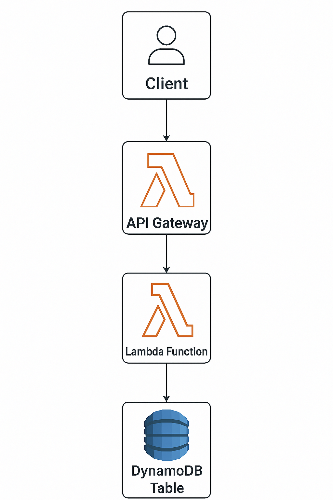

# Serverless Feedback API on AWS using Lambda and Terraform

## Project Description

This project demonstrates how to deploy a **Serverless Feedback API** using **AWS Lambda**, **API Gateway**, and **DynamoDB**, with the entire infrastructure provisioned using **Terraform**. The API allows users to submit feedback, which is then processed and stored in a DynamoDB table — all within a serverless architecture on AWS Free Tier.

---

## Architecture Diagram



---

## Technologies Used

- **AWS Lambda** – Runs the serverless feedback logic
- **Amazon API Gateway** – Exposes the API endpoints
- **Amazon DynamoDB** – Stores feedback data
- **Terraform** – Infrastructure as Code for provisioning resources
- **IAM Roles & Policies** – Secure access management
- **GitHub** – Version control and project tracking

---

## How to Run the Project

### Prerequisites
- AWS CLI configured with appropriate credentials
- Terraform installed
- A DynamoDB-compatible AWS account (Free Tier works)
- Node.js or Python installed (depending on your Lambda runtime)

### Steps

1. **Clone the repository:**
   ```bash
   git clone https://github.com/yourusername/serverless-feedback-api.git
   cd serverless-feedback-api
terraform init
terraform plan
terraform apply
